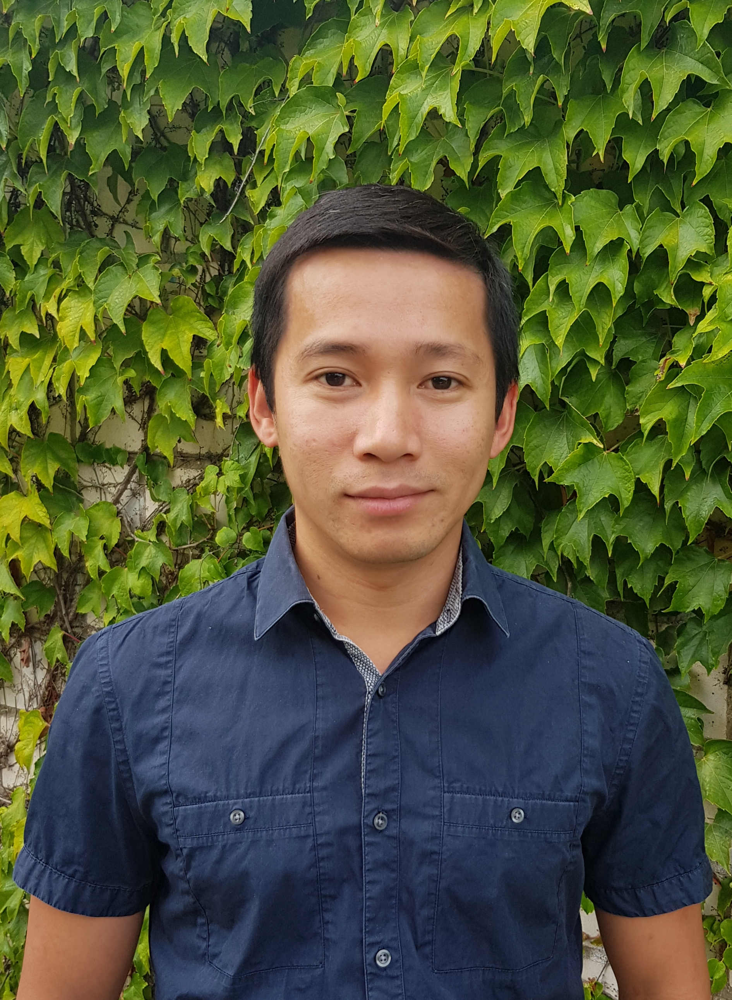

::: {.center}
**Truong-Vinh Hoang**\
:::

::: {.center}
Curriculum Vitae\

  -------------------------------------------------- ----------------------------- --
  **Truong-Vinh Hoang**                                 
                                                                                                                                
  Email: hoang\@uq-rwth.aachen.de                                                  
  Tel: +49-170-843-7228                                                            
  -------------------------------------------------- ----------------------------- --
:::

$~$\
**Former and current Positions**

------------------------------------------------------------------------

$\mathpalette\bigcdot@{1.0}$ 5.2021 - present: **Postdoctoral
researcher**\
[Chair of Mathematics for Uncertainty Quantification]{.nodecor}
(MATHUQ), Department of Mathematics, RWTH Aachen University, url:
<https://www.uq.rwth-aachen.de/go/id/eibnp/?lidx=1>

$\mathpalette\bigcdot@{1.0}$ 10.2017 - 3.2020: **Postdoctoral
researcher**\
[Institute of Scientific Computing]{.nodecor} (WiRe), Faculty of
Information, Carl-Friedrich-Gauß-Fakultät, Technische Universität
Braunschweig, Germany, url: <https://www.tu-braunschweig.de/wire>

$\mathpalette\bigcdot@{1.0}$ 09.2013 - 09.2017: **Research engineer -
Doctoral candidate**\
[Department of Aerospace and Mechanical Engineering, Faculty of Applied
Sciences, University of Liège, Belgium]{.nodecor}, url:
<http://www.ltas-cm3.ulg.ac.be/staff.htm>

$\mathpalette\bigcdot@{1.0}$ 08.2010 - 08.2011: **Research assistant**\
University of Technology, Vietnam National University HCMC, Vietnam,
url: <https://vnuhcm.edu.vn/>

